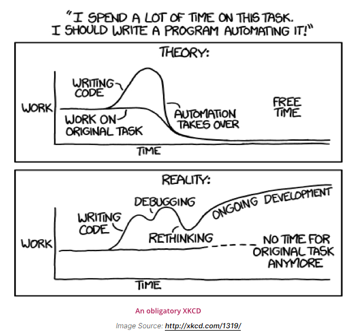

<h2 align="center"><b>Seanime</b></h2>

<h4 align="center">Scan your local library, keep track of progress with AniList integration. Download new episodes or
batches.</h4>

``
Windows, Tauri, Typescript, Next.js, Jotai, AniList API
``

This project is a hobby and is not being made to solve every single edge case.

## Why?

## Features

- [x] Connect to AniList
- [x] Scan local library and match local files with corresponding
  anime. [See classification guide](https://github.com/5rahim/seanime/blob/main/guide.md).
- [x] Show anime list from local library
- [x] Refresh/Re-scan library
- [x] Open episode with default player
- [ ] Automatic progress tracking
  - [ ] Sync progress with AniList
  - [ ] Sync progress with MAL
- [x] Lock/Unlock individual files to speed up scanning
- [x] Ignore filles
  - [ ] Manage/Un-ignore ignored files
- [x] Un-match files (that might be incorrectly matched)
- [x] Resolve unmatched files in-app
  - [ ] Show AniList link using AniZip
- [ ] .unsea/.seaignore file support to ignore a folder
- [ ] Download additional episodes using qBittorent and Nyaa
- [ ] Show additional info like future airing episodes and sequels
- [ ] Stream episode from web source with custom player
- [ ] Browse and manage AniList list
  - [x] View AniList lists
  - [ ] Change score
  - [ ] Update status, remove
- [ ] Show airing schedule for anime in local library
- [ ] Search new anime to download

## Known issues

- :shrug:
