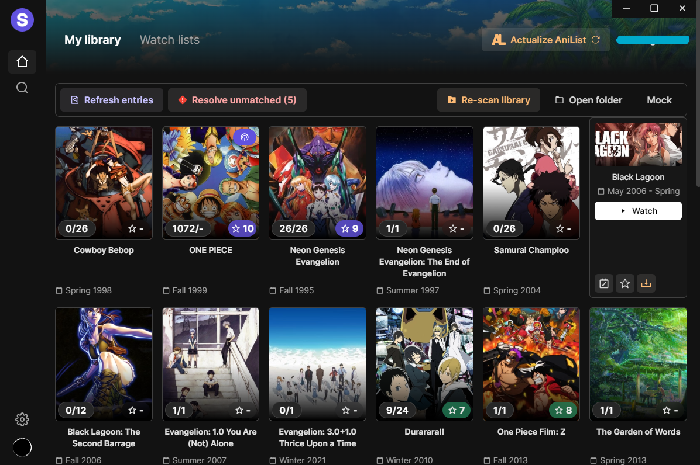

<h2 align="center"><b>Seanime</b></h2>

<h4 align="center">Scan your local library, keep track of progress with AniList integration. Download new episodes or
batches.</h4>



This project is a hobby and is not being made to solve every single edge case.

## Why?

[//]: # (I wanted to make a single client to browse my local files, download/stream new episodes)


## Features

- [x] Scan local library and match local files with corresponding
  anime. [How it works](https://github.com/5rahim/seanime/blob/main/docs/guide.md#how-it-works).
  - [x] Support for various naming/folder
    structures. [Learn more](https://github.com/5rahim/seanime/blob/main/docs/guide.md#tldr).
  - [x] Support for absolute episode
    numbers. [Learn more](https://github.com/5rahim/seanime/blob/main/docs/guide.md#absolute-episode-number).
    - e.g., JJK 01 -> Season 1, JJK 29 -> Season 2
  - [x] Support for movies. [Learn more](https://github.com/5rahim/seanime/blob/main/docs/guide.md#finding-movie).
  - [x] Lock files to speed up subsequent
    scans. [Learn more](https://github.com/5rahim/seanime/blob/main/docs/guide.md#locking-files).
  - [x] Ignore files or folders
  - [x] Logs
  - [ ] File name tag system for faster matching (eg: {id-0001})
- [x] Show anime list from local library
- [x] Refresh/Re-scan library
- [x] Open episode with default player
- [x] Automatic progress tracking
  - [x] Sync progress with AniList
  - [ ] Sync progress with MAL
- [x] Lock/Unlock individual files to speed up scanning
- [x] Ignore files
  - [ ] Manage/Un-ignore ignored files
- [x] Un-match files (that might be incorrectly matched)
- [x] "Resolve unmatched" files features
  - [x] Match single files or folders to a media
  - [x] Option to match files using MAL ID
  - [ ] Show AniList link using AniZip
- [x] Download additional episodes using qBittorent (embedded) and Nyaa (search)
- [x] Show additional info like future airing episodes and sequels
- [ ] Stream episode from web source with custom player
- [x] Browse and manage AniList entries
- [ ] Search new anime

## Try it

```shell
npm install
```

```shell
npm run tauri:dev
```

## Known issues

- :shrug:

## TODO

- [ ] Loading screen to `/view/[id]`
- [ ] Edit file metadata
- [ ] Show a section with new, un-downloaded episodes
- [ ] Preliminary scan to hydrate AniList (for users without anilist data)
- Video

## Resources

Resources used to build Seanime.

- [React](https://react.dev/)
- [Tauri](https://tauri.app/) - Like Electron.js but better
- [Next.js 13](https://nextjs.org/) - React framework + Server actions
- [AniList](https://github.com/AniList/ApiV2-GraphQL-Docs) - API upon which Seanime is built
- [Jotai](https://jotai.org/docs/recipes/large-objects) - State management library
- [Tailwind](https://tailwindcss.com/) - CSS framework built for scale
- [5rahim/chalk-ui](https://chalk.rahim.app/) - UI Components (shameless plug)
- [Consumet](https://github.com/consumet/api.consumet.org) - API for streaming sources
- [rakun](https://github.com/lowlighter/rakun/) - JS Parser for folder and file names
- [nyaasi-api](https://github.com/ejnshtein/nyaasi-api) - Nyaa search API
- [@ctrl/qbittorrent](https://www.npmjs.com/package/@ctrl/qbittorren) - qBittorent API NPM package
- [MPC-HC API](https://github.com/rzcoder/mpc-hc-control) - Original MPC-HC API code
- [VLC API](https://github.com/alexandrucancescu/node-vlc-client) - Original VLC API code
- [GraphQL Codegen](https://the-guild.dev/graphql/codegen) - GraphQL code generation

## Acknowledgement

- [Anikki](https://github.com/Kylart/Anikki/) - Inspired some GraphQL fragments and nomenclatures
- [Miru](https://github.com/ThaUnknown/miru/) - Inspired some AniList utility functions
- [Moopa](https://github.com/Ani-Moopa/Moopa) - Artplayer integration code
