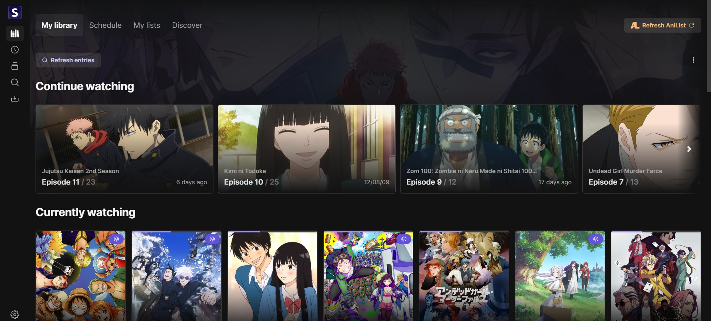

# 🚨 DEPRECATED

**The project has been migrated!**

The Seanime project has been moved to [Seanime Server](https://github.com/5rahim/seanime-server/). This migration was
prompted by a shift in architecture and technologies used. The project now leverages Golang, with the same Web UI,
enhancing overall performance, ease of use, and enabling additional features in the long run.

<h2 align="center"><b>Seanime</b></h2>

<h4 align="center">User-friendly, self-hosted web app for managing your local library with AniList integration</h4>

## Resources

Resources used to build Seanime.

- [React](https://react.dev/)
- [Next.js 14](https://nextjs.org/)
- [AniList](https://github.com/AniList/ApiV2-GraphQL-Docs)
- [Jotai](https://jotai.org/docs/recipes/large-objects) - State management library
- [Tailwind](https://tailwindcss.com/) - CSS framework
- [5rahim/chalk-ui](https://chalk.rahim.app/) - UI Components
- [rakun](https://github.com/lowlighter/rakun/) - Parser
- [nyaasi-api](https://github.com/ejnshtein/nyaasi-api) - Nyaa search API
- [@robertklep/qbittorrent](https://github.com/robertklep/qbittorrent) qBittorent API
- [MPC-HC API](https://github.com/rzcoder/mpc-hc-control) - MPC-HC API
- [VLC API](https://github.com/alexandrucancescu/node-vlc-client) - VLC API
- [GraphQL Codegen](https://the-guild.dev/graphql/codegen)

## Acknowledgements

- [Anikki](https://github.com/Kylart/Anikki/) - Inspired GraphQL fragments
- [Moopa](https://github.com/Ani-Moopa/Moopa) - Artplayer integration
- [Miru](https://github.com/ThaUnknown/miru) - Inspired some utility functions

# Screenshots

## Library

## View

## Discover

## Schedule

## Torrent search & download

## Progress tracking

## Streaming

