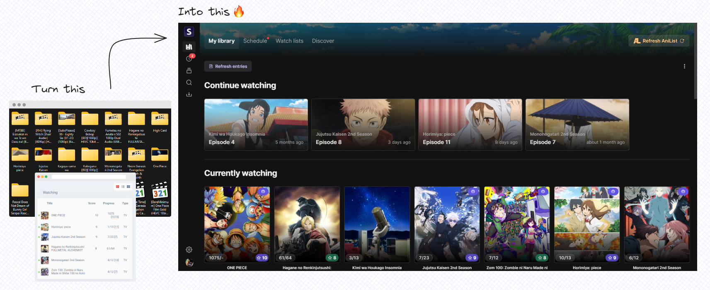
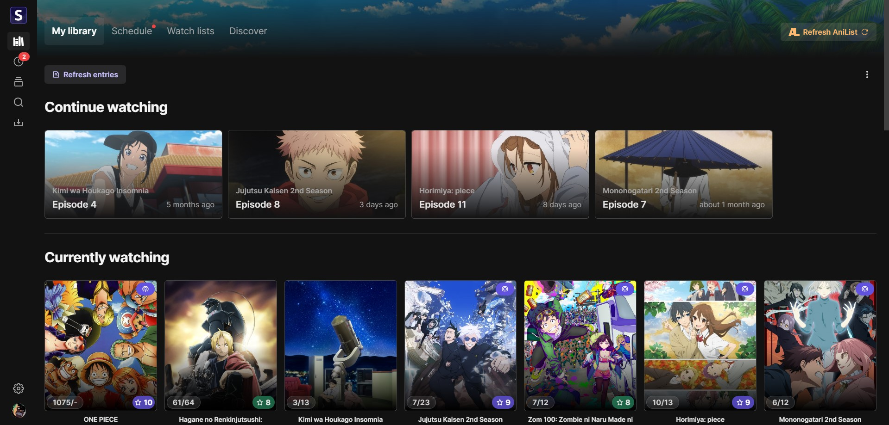
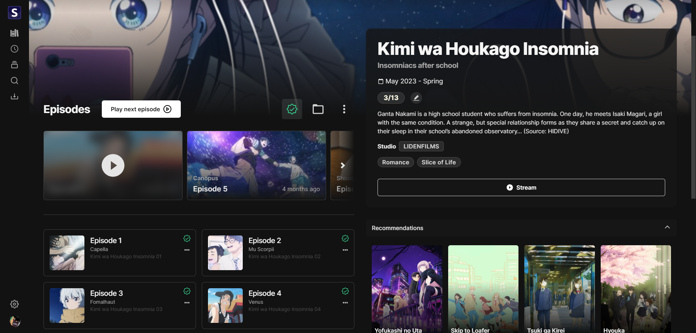
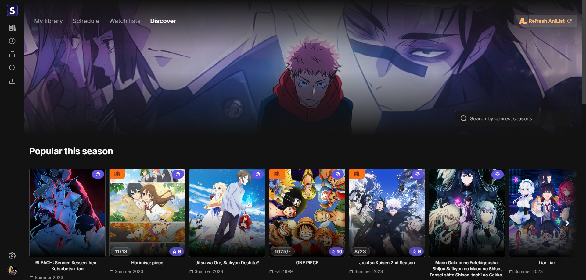
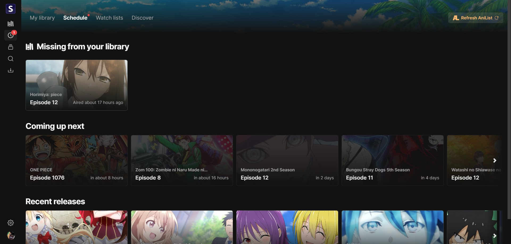
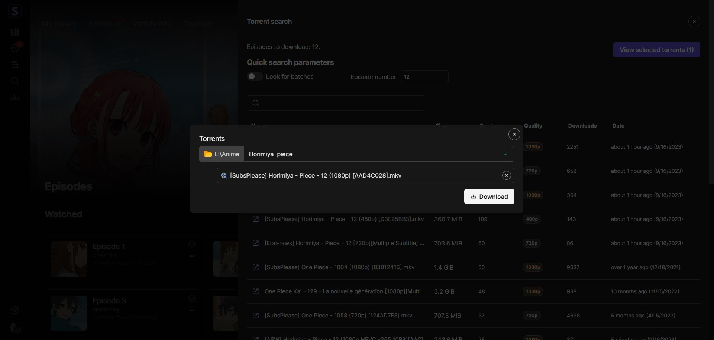
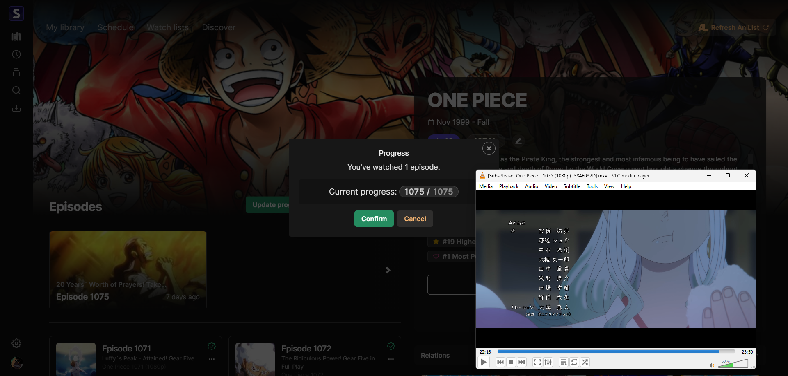
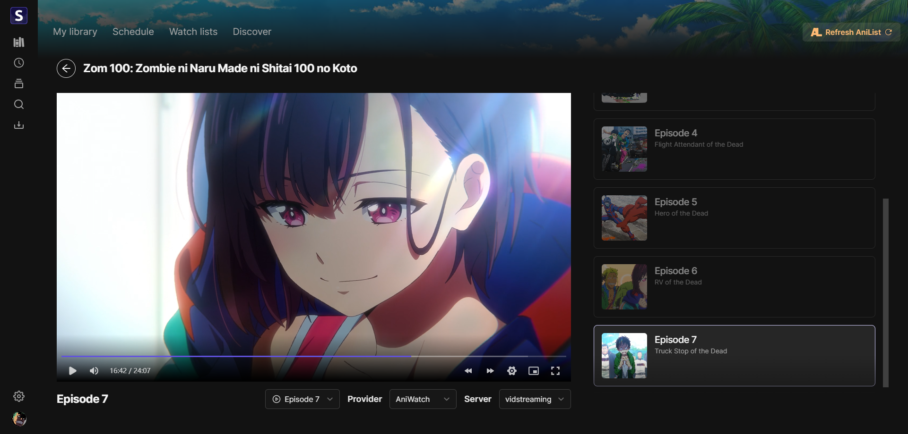

<p align="center">

</p>

<h2 align="center"><b>Seanime</b></h2>

<h4 align="center">User-friendly, self-hosted web app for managing your local library with AniList integration</h4>



🚨 This project is a hobby, it's not meant to fix every shortcoming or include every requested feature. Some features
might not work as intended. Feel free to fork the project, contribute or ask questions.

# Setup

[How to use Seanime.](https://github.com/5rahim/seanime/blob/main/docs/set-up.md)

# Features

## Local library

- [x] Scan local library and automatically match local files with corresponding
  anime.
  - [x] Scan with or without AniList anime list
    data. [Learn more](https://github.com/5rahim/seanime/blob/main/docs/guide.md#scanning-your-library).
  - [x] Support for various naming/folder
    structures. [Learn more](https://github.com/5rahim/seanime/blob/main/docs/guide.md#tldr).
  - [x] Support for absolute episode
    numbers.
  - [x] Support for movies.
  - [x] *Refresh entries*
    feature. [Learn more](https://github.com/5rahim/seanime/blob/main/docs/guide.md#locking-files).
  - [x] Ignore files or folders
  - [x] Resolve unmatched files
  - [x] Update file metadata
    - [x] Episode number, AniDB episode number, Special/OVA or NC status
  - [x] Detailed logs for each scan
- [x] Resolve unmatched files
  - [x] Option to match single files or single folders to a suggested media
  - [x] Option to match files using AniList ID
- [x] Detect episodes missing from your local library
- [ ] Delete files

[How scanning works under the hood.](https://github.com/5rahim/seanime/blob/main/docs/guide.md#how-it-works)

## Download

Powered by qBittorrent and Nyaa

- [x] qBittorrent support via Web API
- [x] In-app basic active torrent list
- [x] In-app embedded qBittorrent client
- [x] In-app torrent search via NYAA
  - [x] Automatic smart filters for search
- [x] Option to automatically select needed files in
  batches. [Learn more](https://github.com/5rahim/seanime/blob/main/docs/torrents.md#batches).

## Progress tracking

- [x] Open files with favorite player (VLC or MPC-HC)
- [x] Automatically track progress while watching with VLC or MPC-HC
- [x] Sync progress with AniList
- [ ] Sync progress with MAL

## AniList

- [x] Browse and manage your AniList anime list
  - [x] Browse your anime lists
  - [x] Add, edit AniList entries (status, score, progress…)
  - [x] Delete AniList entries (Planning list only)
- [x] See trending, popular shows, recent releases
- [x] Search and filter
  - [x] Advanced search (multiple filters)

## Streaming

- [x] Stream episodes from web sources
  - [x] Support for GogoAnime
  - [x] Support for Zoro (AniWatch)
- [x] Progress tracking
  - [x] Sync progress with AniList
  - [ ] Sync progress with MAL


## Disclaimer

[Read the disclaimer.](https://github.com/5rahim/seanime/blob/main/DISCLAIMER.md)

# Development

## Local development

1. Update `.env` file

2. Install packages

```shell
npm install
```

3. Run

```shell
npm run dev
```

## Build

```shell
npm run build
```

- Copy `.next/static` to `.next/standalone/.next/static`
- Copy `public` to `.next/standalone/public`

## Known issues

- Loading toast may persist after scan is complete
- Streaming only works intermittently
- :shrug:

## Not planned

- Watch together feature / social features
- Torrent streaming (use [Miru](https://github.com/ThaUnknown/miru/))
- MAL support
- Mobile app

## Future plans

- Manga support
- Desktop app
- Theming
- Plugins

## Resources

Resources used to build Seanime.

- [React](https://react.dev/)
- [Next.js 13](https://nextjs.org/) - React framework + Server actions
- [AniList](https://github.com/AniList/ApiV2-GraphQL-Docs) - API upon which Seanime is built
- [Jotai](https://jotai.org/docs/recipes/large-objects) - State management library
- [Tailwind](https://tailwindcss.com/) - CSS framework built for scale
- [5rahim/chalk-ui](https://chalk.rahim.app/) - UI Components (shameless plug)
- [Consumet](https://github.com/consumet/api.consumet.org) - API for streaming sources
- [rakun](https://github.com/lowlighter/rakun/) - JS Parser for folder and file names
- [nyaasi-api](https://github.com/ejnshtein/nyaasi-api) - Nyaa search API
- [@robertklep/qbittorrent](https://github.com/robertklep/qbittorrent) Original qBittorent API code
- [MPC-HC API](https://github.com/rzcoder/mpc-hc-control) - Original MPC-HC API code
- [VLC API](https://github.com/alexandrucancescu/node-vlc-client) - Original VLC API code
- [GraphQL Codegen](https://the-guild.dev/graphql/codegen) - GraphQL code generation
- [M3U8Proxy](https://github.com/chaycee/M3U8Proxy) - Video streaming proxy
- [Anify](https://github.com/Eltik/Anify/tree/main) - Covers for episodes

## Acknowledgements

- [Anikki](https://github.com/Kylart/Anikki/) - Inspired GraphQL fragments
- [Moopa](https://github.com/Ani-Moopa/Moopa) - Artplayer integration
- [Miru](https://github.com/ThaUnknown/miru) - Inspired some utility functions

# Screenshots

## Library



## View



## Discover



## Schedule



## Torrent search & download



## Progress tracking



## Streaming


