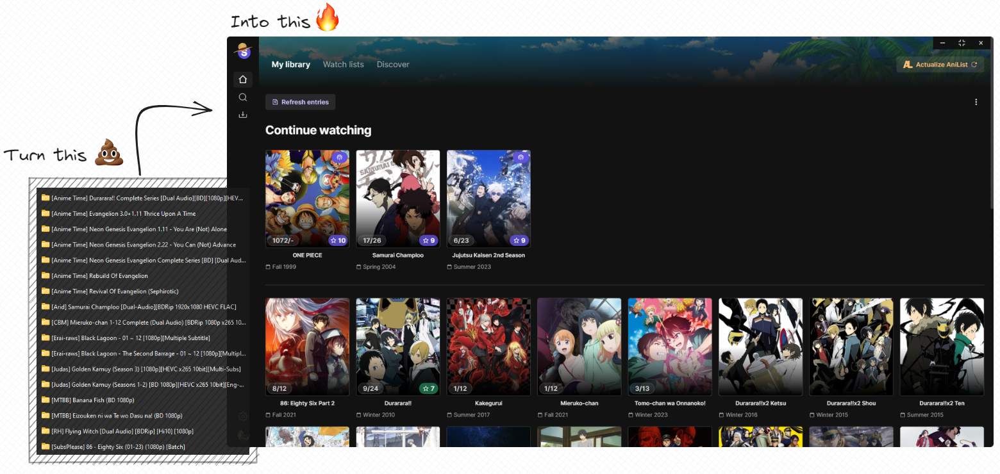

<h2 align="center"><b>Seanime</b></h2>

<h4 align="center">Feature-packed, user-friendly app for managing your local library with AniList integration</h4>



🚨 This project is a hobby and doesn't aim to solve every unique issue or address all complaints you may have about
similar software.

## Disclaimer

[Read the disclaimer](https://github.com/5rahim/seanime/blob/main/DISCLAIMER.md).

## Features

### Local library
- [x] Scan local library and match local files with corresponding
  anime. [How it works](https://github.com/5rahim/seanime/blob/main/docs/guide.md#how-it-works).
  - [x] Support for various naming/folder
    structures. [Learn more](https://github.com/5rahim/seanime/blob/main/docs/guide.md#tldr).
  - [x] Support for absolute episode
    numbers. [Learn more](https://github.com/5rahim/seanime/blob/main/docs/guide.md#absolute-episode-number).
    - e.g., JJK 01 -> Season 1, JJK 29 -> Season 2
  - [x] Support for movies. [Learn more](https://github.com/5rahim/seanime/blob/main/docs/guide.md#finding-movie).
  - [x] Lock files to speed up subsequent
    scans. [Learn more](https://github.com/5rahim/seanime/blob/main/docs/guide.md#locking-files).
  - [x] Ignore files or folders
  - [x] Resolve unmatched files
  - [x] Logs*
  - [ ] Update file metadata
- [x] Resolve unmatched files
  - [x] Match single files or folders to a media
  - [x] Option to match files using AniList ID

### Download

- [x] qBittorent support
- [x] Detect un-downloaded episodes
- [x] In-app torrent search via NYAA
  - [x] Automatic smart filters for search
- [x] Option to automatically select needed files in
  batches. [Learn more](https://github.com/5rahim/seanime/blob/main/docs/torrents.md#batches).
- [ ] "Schedule" feature

### Progress tracking

- [x] Open files with favorite player (VLC or MPC-HC)
- [x] Automatically track progress with VLC or MPC-HC
- [x] Sync progress with AniList
- [ ] Sync progress with MAL

### AniList

- [x] Browse and manage AniList entries
  - [x] Browse your watch lists
  - [x] Add, edit, AniList entries (status, score, progress…)
- [x] See trending, search and filter
  - [x] Discover page
  - [x] Advanced search

### Streaming

- [x] Stream episodes from web sources
  - [x] Support for GogoAnime
  - [x] Support for Zoro (AniWatch)
  - [ ] Support for Crunchyroll

### Other

- [ ] Offline mode


<br/>


## Caveats

For the time being, users must ensure their AniList watchlist includes all media present in their local library before
initiating the scanning process.
This is because Seanime relies on the user's AniList data to accurately match episode files and organize them
effectively.
Failure to do so may result in incorrect matches, especially when dealing with different seasons
of the same series.

## Development

1. Update `.env` file

```dotenv
# Deploy your Consumet API https://github.com/consumet/api.consumet.org#vercel
CONSUMET_API_URL="https://consumet-api-example.vercel.app"
```

2. Install packages

```shell
npm install
```

3. Enjoy

```shell
npm run dev
```

## Known issues

- :shrug:

## Not planned

- Watch together feature / social features
- Torrent streaming (use [Miru](https://github.com/ThaUnknown/miru/))
- Progress tracking without AniList
- Mobile app

## Future plans

Features that may be implemented

- Manga support
- Auto-download new episodes

## TODO

- [ ] (torrent search) Improve smart filters for batches
- [ ] (local file) Edit file metadata
- [ ] (schedule) Show a section with new, un-downloaded episodes
- [ ] (library) Preliminary scan to hydrate AniList (for users without anilist data)
- [ ] (settings) Update settings local directory picker
- [ ] (local file) Manage/Un-ignore ignored files
- [ ] (library) Optimize episode number normalization during scan with cache (library-entry.ts L171)
- [ ] (advanced search) Filter by studios
- [ ] (library) Filename tag system for faster matching
- [ ] (repository) Delete files
- [ ] Offline mode
- [ ] Logs settings, directory, display logs in-app
- [ ] Option to automatically update progress without confirmation
- [ ] Start qBittorrent if it is not launched

## Resources

Resources used to build Seanime.

- [React](https://react.dev/)
- [Tauri](https://tauri.app/) - Like Electron.js but better
- [Next.js 13](https://nextjs.org/) - React framework + Server actions
- [AniList](https://github.com/AniList/ApiV2-GraphQL-Docs) - API upon which Seanime is built
- [Jotai](https://jotai.org/docs/recipes/large-objects) - State management library
- [Tailwind](https://tailwindcss.com/) - CSS framework built for scale
- [5rahim/chalk-ui](https://chalk.rahim.app/) - UI Components (shameless plug)
- [Consumet](https://github.com/consumet/api.consumet.org) - API for streaming sources
- [rakun](https://github.com/lowlighter/rakun/) - JS Parser for folder and file names
- [nyaasi-api](https://github.com/ejnshtein/nyaasi-api) - Nyaa search API
- [@ctrl/qbittorrent](https://www.npmjs.com/package/@ctrl/qbittorren) - qBittorent API NPM package
- [MPC-HC API](https://github.com/rzcoder/mpc-hc-control) - Original MPC-HC API code
- [VLC API](https://github.com/alexandrucancescu/node-vlc-client) - Original VLC API code
- [GraphQL Codegen](https://the-guild.dev/graphql/codegen) - GraphQL code generation
- [Moopa](https://github.com/Ani-Moopa/Moopa) - Video streaming Proxy (Temporary)

## Credit

- [Anikki](https://github.com/Kylart/Anikki/) - Inspired some GraphQL fragments and nomenclatures
- [Miru](https://github.com/ThaUnknown/miru/) - Inspired some AniList utility functions
- [Moopa](https://github.com/Ani-Moopa/Moopa) - Artplayer integration code
