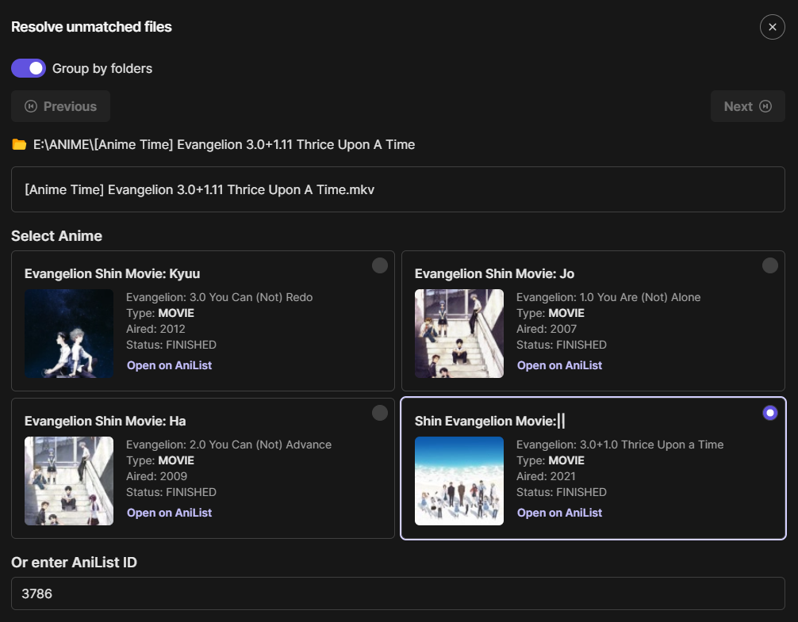
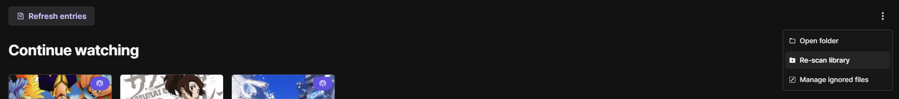

# Guide

## AniList

For the time being, users must ensure their AniList watchlist includes all media present in their local library before
initiating the scanning process.
This is because Seanime relies on the user's AniList data to accurately match episode files and organize them
effectively.
Failure to do so may result in incorrect matches, especially when dealing different seasons
of the same series.

### What about MAL?

Seanime does not currently support media matching using MAL data. I recommend you create an AniList account and use a
tool like
MAL-Sync to automatically sync data effortlessly.

## Mis-matched files

When some episode files are unmatched it generally means that:

- You did not have that anime in your AniList watch list.
  - Seanime uses your AniList data to match episode files.
  - Seanime will try to match with sequels or prequels that are not on your watch list but may not find earlier or
    later seasons. Let's say your have the 1st, 2nd and 3rd Season in your library but only have the 1st season added in
    your watch list, Seanime might incorrectly match 3rd season files with the 2nd season. If it is the case, you can
    manually unmatched the files and use the `Resolve unmatched` features OR manually add the anime to your AniList
    watch list
    and refresh entries.
- The structure is inconsistent.
- Confused parts/cours with seasons.
  - Some torrent names will inappropriately classify cours/parts as seasons. When it is the case, you should rename
    parent folders so that they match AniList names.
- Movies may be matched incorrectly if they are not in separate folders
- Specials/OVAs might be matched incorrectly.

### Solutions

#### Renaming

You may discover that some episodes or seasons are not matched correctly, if this is the case:

- You should **lock** the correct files, **un-match** incorrect ones, **rename** them and retry by **refreshing entries
  **.
- Rename parent folders so that their name accurately matches the titles on AniList.

### Example of fixes

```text
├── %LIBRARY_FOLDER%
    ├── Jujutsu Kaisen
        ├── Season 1
        │   └── ...
        ├── Season 2
        │   └── ...
        └── Movie
            └── Jujustu Kaisen 0.mkv            <- This MIGHT NOT be matched correctly
            
Fix: Ensure that the movie is in your AniList watchlist, move or rename the file.

├── %LIBRARY_FOLDER%
    └── Jujutsu Kaisen
        ├── Season 1
        │   └── ...
        ├── Season 2
        │   └── ...
        └── Jujustu Kaisen 0
            └── Jujustu Kaisen 0.mkv             <- Good

```

```txt
├── %LIBRARY_FOLDER%
    ├── Fruits Basket S1-3
        ├── Fruits Basket S01                   <- This might be matched to the 2001 version. 
        │   └── ...                                Rename to "Fruits Basket (2019)"
        ├── Fruits Basket S02
        │   └── ...
        └── Fruits Basket S03
            └── ...
            
Fix: Use AniList titles
```

### "Resolve unmatched" feature


<br/>


- This feature allows you to match files to specific anime that you choose either from the suggestions or the AniList ID
  input.
- The files will be automatically locked so that subsequent refreshes will not unmatch them again.
- You should use it as the **LAST** resort because the next time your scan (not refresh) your library, they will be
  unmatched.

## Locking files


Locking is a feature made to speed up refreshing entries.
It just tells Seanime that these files were correctly matched and to skip them when **refreshing** entries next time.

## Ignoring files

You can add a `.unsea` file to a folder if you want Seanime to skip its content.

Caveats: If you have locked some files in the folder, **re-scan** the library after adding the `.unsea` file.
This is because the files might still show up on Seanime when you only **refresh**.

## Refresh vs Scan



### Refreshing entries

Seanime will skip **locked** and **ignored** files, this will speed up the process.
You can also refresh after you manually delete some files (even if they were locked or ignored).

### Scanning library

Scanning (or re-scanning) will go through all files even if they are locked or ignored.
Optimally, you should only scan once, or each time you change your library folder.

## Structure

### Recommended structure

```text
├── %LIBRARY_FOLDER%
    └── {Anime title}
        └── {Anime title} Season 1
            └── {Anime title} - S01E05.mkv
```

#### With episode titles in file name

- When there is an episode title, make sure the episode number is enclosed with "-"
- Make sure the folder name has the anime title, especially if the file does not have it

```text
├── %LIBRARY_FOLDER%
    └── Bungo Stray Dogs
        └── Bungo Stray Dogs Season 5
            ├── Bungo Stray Dogs Season 5 - S05E05 - {Episode title}.mkv
            ├── S05E05 - {Episode title}.mkv
            └── ...
```

## How it works

- Seanime will try to match **files** to an anime using parsed info from the file name and its parent folders.
- Parsed data include: the title, the season and the episode number.
- The matching algorithm will create **candidate** titles from:
    - The file name (Can incorrectly use episode title if the format is unconventional)
    - The folder name
    - Folder name + file name, if they do no match
    - The parsed season

### Finding anime by title variations

```text
├── %LIBRARY_FOLDER%
    └── Jujustu Kaisen S1-2
        └── Jujustu Kaisen Season 1             <- (1) Captures season \/
            └── Jujustu Kaisen S01E01.mkv       <- (2) Captures title (ignores season)
            
---> Will try [Jujustu Kaisen, Jujustu Kaisen Season 1, ...]
```

```text
├── %LIBRARY_FOLDER%
    └── Jujustu Kaisen S1-2
        └── Season 2                            <- (1) Captures season \/
            └── Jujustu Kaisen 01.mkv           <- (2) Captures title

---> Will try [Jujustu Kaisen Season 2, Jujustu Kaisen Part 2, ...]
```

```text
├── %LIBRARY_FOLDER%
    └── Jujustu Kaisen S1-2                     <- (1) Captures title (ignores range) \/
        └── Season 1                            <- (2) Captures season \/
            └── Jujustu Kaisen S01E01.mkv       <- (3) Captures title (ignores season)

---> Will try [Jujustu Kaisen, Jujustu Kaisen Season 1, ...]
```

```text
(Not recommended, prefer subfolders)

├── %LIBRARY_FOLDER%           
    └── Jujustu Kaisen S02E01.mkv               <- Captures title and season
    
---> Will try [Jujustu Kaisen Season 2, ...]
```

#### Edge cases
```

```text
├── %LIBRARY_FOLDER%                              
    └── Fruits Basket S1-3                      <- Captures title (ignores range)
        └── Fruits Basket S2                    <- Overrides previous title, captures season \/
            └── Spring comes - S02E01.mkv       <- (v1) Captures "Spring comes"

---> Will try [Fruits Basket Season 2, ..., Spring comes Season 2, ..., Fruits Basket Spring comes Season 2, ...]
---> However, since the folder's title is prioritized the episode title might not negatively impact the matching process
---> Make sure the episode title comes AFTER (e.g., "S02E01 - Spring comes.mkv")
```

### More about seasons

Seanime will first try to locate the season from the file name, then look for it in the parent folder.

```text
├── %LIBRARY_FOLDER%
    └── Anime title                             
        └── Anime title Season 1                <- Season ignored
            ├── Anime title S01E05.mkv          <- Season 1 found
            ├── Anime title 01x05.mkv           <- Season 1 found
            ├── Anime title S1_5.mkv            <- Season 1 found
            └── ...
```

```text
├── %LIBRARY_FOLDER%
    └── Anime title                             
        └── Anime title Season 1                <- (2) Season 1 found
            ├── Anime title E05.mkv             <- (1) No season found, go up /\
            └── ...
```

### Episode number

Seanime will search the file title for the episode number.

### Example (Episode 5)

```text
├── %LIBRARY_FOLDER%
│   ├── Jujutsu Kaisen
│   │   ├── Season 1
│   │   │   ├── Jujutsu Kaisen S01E05.mkv  #BEST
│   │   │   ├── Jujutsu Kaisen 05.mkv
│   │   │   ├── Jujutsu Kaisen 05v2.mkv    
│   │   │   ├── Jujutsu Kaisen 05'.mkv 
│   │   │   ├── Jujutsu Kaisen 05.2.mkv    
│   │   │   ├── Jujutsu Kaisen 01x05.mkv...................<- Equivalent to S01E05
│   │   │   ├── Jujutsu Kaisen S1 - 05.mkv                  
│   │   │   ├── Jujutsu Kaisen S1_5.mkv                    
│   │   │   ├── Jujutsu Kaisen 05 Episode title.mkv    
│   │   │   ├── Jujutsu Kaisen 2 - E05.mkv 
│   │   │   ├── Jujutsu Kaisen 2 - 05 - Episode title.mkv   
│   │   │   ├── S01E05 - Episode title.mkv   
│   │   │   │
│   │   │   ├── Jujutsu Kaisen 5.mkv.......................<- This will be IGNORED, rename to "Jujutsu Kaisen 05"
│   │   │   ├── Jujutsu Kaisen 2 05 Episode title.mkv......<- This will be IGNORED
│   │   │   ├── Jujutsu Kaisen 1-5.mkv.....................<- This will be IGNORED as it is considered as a range
│   │   │   ├── Jujutsu Kaisen S1-5.mkv....................<- This will be IGNORED as it is considered as a range
│   │   │   ├── Jujutsu Kaisen 5_2.mkv.....................<- This will return 2 - Avoid versioning with "_"
│   │   │   ├── Jujutsu Kaisen 05x02.mkv...................<- This will return 2 - Avoid versioning with "x"
│   │   │   └── ...
│   │   └── ...
```

### Absolute episode number

Absolute episode numbers will be normalized to relative episode number and will not impact the matching process.

```text
├── %LIBRARY_FOLDER%
│   ├── Jujutsu Kaisen
│   │   ├── Jujutsu Kaisen 01.mkv           <- Matched to Jujutsu Kaisen Season 1, Episode 1
│   │   ├── Jujutsu Kaisen 29.mkv           <- Matched to Jujutsu Kaisen Season 2, Episode 5
```

### Finding movie

```text
├── %LIBRARY_FOLDER%
    ├── {Movie title}
    │   └── {Movie title}.mkv
    └── {Another movie}
        └── {Another movie}.mkv
```

```text
├── %LIBRARY_FOLDER%
    ├── {Movie title}.mkv
    └── {Another movie}.mkv
```

```text
Avoid this

├── %LIBRARY_FOLDER%
    └── Neon Genesis Evangelion Complete Series
        ├── Neon Genesis Evangelion 01.mkv         
        ├── Neon Genesis Evangelion 02.mkv          
        ├── ...            
        └── Rebuild Of Evangelion 
            └── Evangelion: 2.0 You Can (Not) Advance.mkv

Do this

├── %LIBRARY_FOLDER%
    ├── Neon Genesis Evangelion Complete Series
    │   ├── Neon Genesis Evangelion 01.mkv         
    │   ├── Neon Genesis Evangelion 02.mkv          
    │   └── ...            
    └── Evangelion: 2.0 You Can (Not) Advance
        └── Evangelion: 2.0 You Can (Not) Advance.mkv

OR

├── %LIBRARY_FOLDER%
    └── Neon Genesis Evangelion Complete Series
        ├── Neon Genesis Evangelion                             <- Add a sub-folder for the episodes
        │   ├── Neon Genesis Evangelion 01.mkv         
        │   ├── Neon Genesis Evangelion 02.mkv          
        │   └── ...            
        └── Evangelion: 2.0 You Can (Not) Advance
            └── Evangelion: 2.0 You Can (Not) Advance.mkv
```

### Algorithms

Scanning employs 3 comparison algorithms: Dice's coefficient (string-similarity), Levenshtein's algorithm (
js-levenshtein), and MAL's elastic search. These are the steps for **every single** file:

- Parse candidate titles that will be used for comparison from file name and folder names
- Parse a season from folder name or file name
- Find multiple variations of the title with the seasons for comparison (explained in previous section)
- Compare title variations to all media titles (userPreferred, english, and romaji, synonyms) from user's AniList +
  related
  prequels and sequels that are not in the watch list.
  - Using Dice's coefficient, get most similar title from user's watch list
  - Using Levenshtein's algorithm, get most similar title from user's watch list
  - Using MAL's elastic search, get most similar title from MAL
- From these 3 titles, eliminate the least similar one using Dice's coefficient
- From these 2 best matches, find the most similar to the parsed title using Dice's coefficient
- Return the media from user's watch list

### Cache

Seanime uses an internal cache system to speed up the media matching process.
It uses **title variations** as keys.

This is perfect if your episode files have consistent names.

```
├── %LIBRARY_FOLDER%
    └── Jujustu Kaisen                             
        └── Jujustu Kaisen Season 2                
            ├── Jujustu Kaisen 01.mkv          
            ├── Jujustu Kaisen 02.mkv           
            ├── Jujustu Kaisen 03.mkv            
            ├── Jujustu Kaisen 04.mkv            
```

```
[media-matching]:  (Cache MISS) Jujustu Kaisen 01           <- ~1s - key: "[Jujustu Kaisen Season 2, Jujustu Kaisen 2nd Season]"
[media-matching]:  (Cache HIT) Jujustu Kaisen 02            <- < 1ms - key: "[Jujustu Kaisen Season 2, Jujustu Kaisen 2nd Season]"
[media-matching]:  (Cache HIT) Jujustu Kaisen 03            <- < 1ms - key: "[Jujustu Kaisen Season 2, Jujustu Kaisen 2nd Season]"
[media-matching]:  (Cache HIT) Jujustu Kaisen 04            <- < 1ms - key: "[Jujustu Kaisen Season 2, Jujustu Kaisen 2nd Season]"
```

However, if your episode files do not have consistent names, the matching process will slow down considerably.

```
├── %LIBRARY_FOLDER%
    └── Black Lagoon                             
        └── Black Lagoon                
            ├── The Black Lagoon 01.mkv          
            ├── Mangrove Heaven 02.mkv           
            ├── Ring-Ding Ship Chase 03.mkv            
```

```
[media-matching]:  (Cache MISS) The Black Lagoon 01         <- ~1s -  key: "[Black Lagoon, The Black Lagoon]"
[media-matching]:  (Cache MISS) Mangrove Heaven 02          <- ~1s - key: "[Black Lagoon, Mangrove Heaven]"
[media-matching]:  (Cache MISS) Ring-Ding Ship Chase 03     <- ~1s - key: "[Black Lagoon, Ring-Ding Ship Chase]"
```

## TL;DR

- You **might** not need to rename torrent files, the parser will extract the necessary information and ignore the rest
  - `[Group] Anime [Dual-Audio][BDRip 1920x1080 HEVC FLAC]` = `Anime`
  - `[Group] Anime S01E01 [8CE6090E].mkv` = `Anime S01E01`
  - See **Unmatched/Incorrectly matched files** to see when you need to rename files.
- `SX` and `Season X` can be used interchangeably
- `SXEX` and `S0XE0X` can be used interchangeably

The following examples will also work with torrent file names. Just make sure that the basic structure and parsable
information are the same.

Batch

- `SX-Y` = `Season X-Y` = `Season X ~ Y`
- The range is not necessary as it will be
  ignored. `{Anime Title} S1-3` = `{Anime Title}` = `{Anime Title} Complete series` etc…


- `~ \ {Anime Title} S1-3 \ {Anime Title} Season 1 \ {Anime Title} S01E01.mkv` -> BEST
- `~ \ {Anime Title} S1-3 \ {Anime Title} Season 1 \ {Anime Title} 01.mkv` -> Good
- `~ \ {Anime Title} S1-3 \ {Anime Title} \ {Anime Title} S1E1.mkv` -> Good
- `~ \ {Anime Title} S1-3 \ Season 1 \ {Anime Title} S01E01.mkv` -> Good
- `~ \ {Anime Title} S1-3 \ Season 1 \ {Anime Title} 01.mkv` -> Good

1 parent folder

- `~ \ {Anime Title} Season 1 \ {Anime Title} S01E01.mkv` -> Good
- `~ \ {Anime Title} \ {Anime Title} S01E01.mkv` -> Good
- `~ \ {Anime Title} Season 1 \ {Anime Title} 01.mkv` -> Good
- `~ \ {Anime Title} \ Season 1 \ {Anime Title} S01E01.mkv` -> Good
- `~ \ {Anime Title} \ Season 1 \ {Anime Title} 01.mkv` -> Good
- `~ \ {Anime Title} Season 1 \ E1.mkv` -> Good
- `~ \ {Anime Title} \ E1.mkv` -> Good

With episode titles

- `~ \ ... \ {Anime Title} \ {Anime Title} - S01E1 - {Episode title}.mkv` -> BEST
- `~ \ ... \ {Anime Title} \ S01E1 - {Episode title}.mkv` -> Good
- `~ \ ... \ {Anime Title} \ {Episode title} - S01E1.mkv` -> BAD

Without seasons

- `~ \ {Anime Title} \ {Anime Title} 01.mkv` -> Good
- `~ \ {Anime Title} \ {Anime Title} E1.mkv` -> Good
- `~ \ {Anime Title} \ E1.mkv` -> Good
- `~ \ {Anime Title} \ {Anime Title} 1.mkv` -> AVOID

Root folder

- `~ \ {Anime Title} S1E1.mkv` -> Good
- `~ \ {Anime Title} - 01 - {Episode title}.mkv` -> Good
- `~ \ {Anime Title} - {Episode title} - E1.mkv` -> AVOID

Movies

- `~ \ {Movie title} \ {Movie title}.mkv` -> BEST
- `~ \ {Anime Title} S1-3+Movie \ {Movie title} \ {Movie title}.mkv` -> Good
- `~ \ {Anime Title} S1-3+Movie \ {Anime Title} (Movie) \ {Movie title}.mkv` -> Meh
- `~ \ {Anime Title} S1-3+Movie \ {Anime Title} Movie \ {Movie title}.mkv` -> BAD

Specials/NC

- `~ \ {Special's title} \ {Special's title}.mkv` -> Good (If the special has an entry on AniList. e.g.,
  One Punch Man OVA)
- `~ \ {Anime Title} \ Specials \ {Special's title}.mkv` -> Good
- `~ \ {Anime Title} \ Specials \ {Anime Title} S00E(1-9).mkv` -> Good
- `~ \ {Anime Title} \ Others \ {Anime Title} (OP|ED)(1-9).mkv` -> Good
