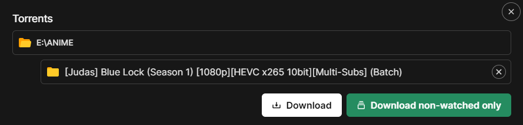

## Batches

### Auto-select non-watched episodes

- This feature allows you to automatically download only non-watched episodes from a specific batch.
- Seanime will detect non-watched episodes based on your current AniList progress for that specific anime.
- This is ideal when you haven't watched an anime in a while and the individual episode torrents are not seeded anymore.
- Support for absolute episode numbers

#### Caveats

- This feature uses Seanime's internal parsing algorithm, and it **may not accurately detect episodes** if the file
  names
  are formatted strangely.
- **It will not work with batches containing multiple seasons.** (yet)
- It will not download NCs, OVA/Specials or movies.
