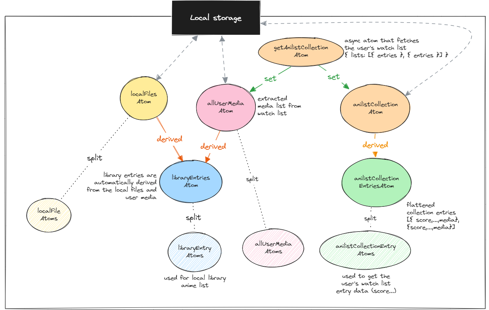

## Thinking Jotai

Jotai allows for a better handling of re-rendering.
By deriving and splitting atoms, we can listen to specific changes and update data at different levels.
[Learn more](https://jotai.org/docs/recipes/large-objects).

### Local files

Local files contain data regarding their media and current state.
They are stored in an array which is an atom. The atom is then split so components can subscribe to specific files while
ignoring the rest.
With memoization, we stop unnecessary re-renders.

```ts

// Atom derived from `localFileAtoms` and `anilistCollectionEntryAtoms`
const get_ToWatch_LocalFileAtomsByMediaIdAtom = atom(null,
    // Get the local file atoms from a specific media
    // Split the `watched` and `to watch` file atoms by listening to a specific `anilistCollectionEntryAtom`
    (get, set, mediaId: number) => {
    },
)

export const useMainLocalFileAtomsByMediaId = (mediaId: number) => {
    // This will update only when the specific entry changes
    const collectionEntry = useAtomValue(
        selectAtom(
            anilistCollectionEntriesAtom,
            useCallback(entries => entries.find(entry => entry?.media?.id === mediaId), []), // Stable reference
            deepEquals, // Equality check
        ),
    )
    const [, get] = useAtom(get_ToWatch_LocalFileAtomsByMediaIdAtom)
    return useMemo(() => get(mediaId), [collectionEntry]) // Actualize atom list when collection entry changes 
}
```


